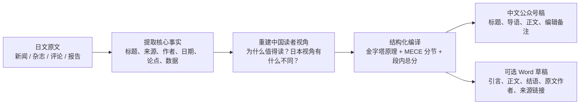
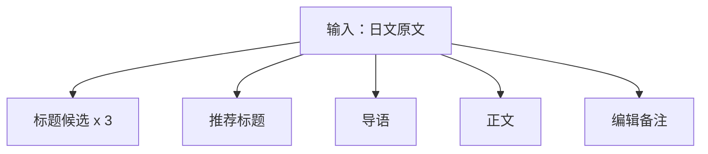
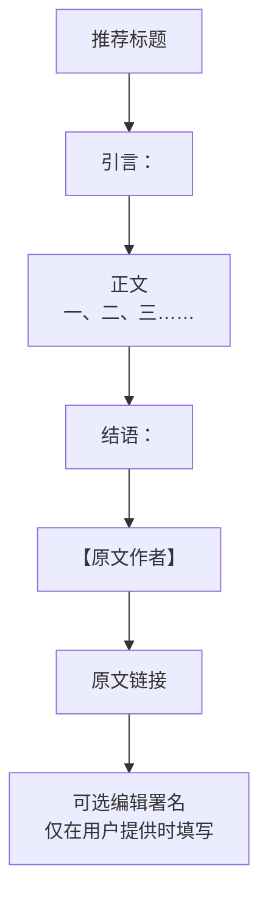
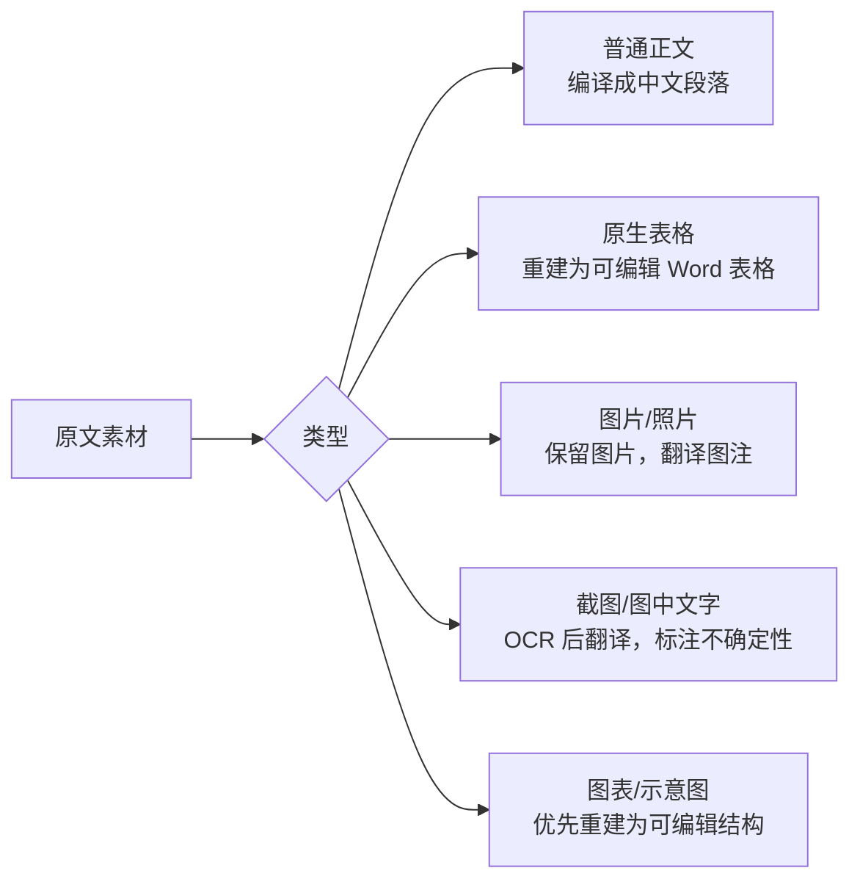

# 知日鉴中

面向 Codex 的公众号编译 Skill。技术名：`zhiri-jianzhong`。

它把日文科技、科技政策、创新治理、产业技术和软科学类文章，编译成适合中国读者阅读的简体中文公众号稿。

它不是逐句翻译器。它的目标是把日本来源文章重新组织成逻辑清楚、结构 MECE、适合移动端阅读、同时保持智库式严谨度的中文文章。

## 它解决什么问题



适用场景：

- 从日文科技新闻编译中文公众号稿
- 把日本政策、产业、科研、技术治理类文章改写成中国读者更容易理解的文章
- 从日本视角提炼对科技政策研究者、智库读者、产业分析读者有价值的洞察
- 为公众号生成标题、导语、正文结构、结语和编辑备注
- 在需要时生成 Word `.docx` 草稿，并处理原文中的表格、图片和图注

## 能产出什么

默认输出：



Word 输出模式：



## 内容风格

这个 Skill 会优先保证：

1. 忠于原文事实和语气
2. 对中国科技政策读者有解释价值
3. 结构清楚，先总后分
4. 章节之间 MECE，不重复堆叠
5. 表达克制，不使用营销号式夸张标题
6. 不把未经原文支持的判断写成结论

它会避免：

- 逐段搬运式翻译
- 空泛的“对中国具有重要启示”
- “重磅”“炸裂”“颠覆认知”等夸张表达
- 未核实的数字、日期、政策背景或机构关系
- 编造作者、来源、署名、编辑委员会等私有信息

## 安装

把仓库克隆到 Codex skills 目录：

```bash
mkdir -p ~/.codex/skills
git clone https://github.com/shawxu222/zhiri-jianzhong.git ~/.codex/skills/zhiri-jianzhong
```

重启 Codex 或开启新对话后，可以用：

```text
Use $zhiri-jianzhong to turn this Japanese article into a polished Chinese WeChat draft for tech policy readers.
```

也可以直接用中文说明：

```text
请使用 $zhiri-jianzhong，把下面这篇日文文章编译成面向中国科技政策读者的公众号文章。
```

## 推荐输入格式

为了得到更稳定的结果，建议提供：

```text
请使用 $zhiri-jianzhong 编译下面这篇文章。

输出形式：公众号正文 / Word 草稿
来源：
原文标题：
作者：
发布时间：
原文链接：
我选择这篇文章的原因：

【日文原文】
...
```

如果只贴正文也可以使用；缺失的来源、作者、日期等信息会被标在编辑备注中。

## Word 和图表处理



处理原则：

- 原生表格优先转为可编辑 Word 表格
- 图片中的文字需要 OCR，不能保证完全无误
- 如果图像内容复杂，优先在正文或图注中解释，而不是强行改图
- 如果用户提供 Word 模板，Skill 会借鉴结构和视觉节奏，但不会复制旧文章内容

## 文件结构

```text
zhiri-jianzhong/
├── SKILL.md
├── agents/
│   └── openai.yaml
└── references/
    ├── editorial-standard.md
    ├── success-sample-patterns.md
    └── word-output-standard.md
```

核心文件：

- `SKILL.md`: Skill 入口、触发说明和默认工作流
- `references/editorial-standard.md`: 翻译、编译、结构和事实纪律
- `references/success-sample-patterns.md`: 文章结构和公众号表达模式
- `references/word-output-standard.md`: Word 输出、表格、图片和署名处理规则

## 隐私与可配置项

这个公开版本不包含私有 Word 模板、真实编辑委员会名单、公司内部信息或历史文章全文。

如果你有自己的公众号格式，可以在使用时提供：

- Word 模板
- 固定栏目顺序
- 编辑署名规则
- 标题风格偏好
- 术语表或禁用表达

Skill 应只把这些信息用于当前任务，除非你明确把它们写入自己的本地私有版本。

## 版权与来源纪律

处理新闻、杂志和付费内容时，建议把输出定位为“编译与解读”，而不是完整逐句翻译。Skill 会默认重组结构、概括事实、解释背景，并避免复刻原文段落顺序和独特表达。
